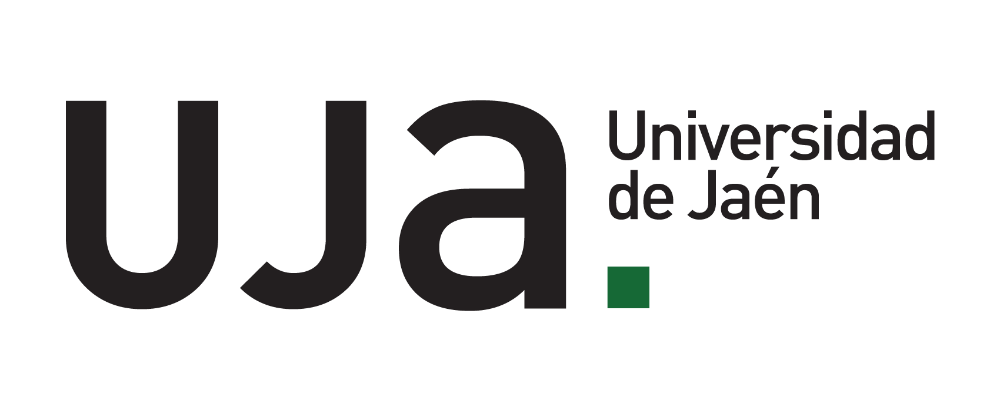
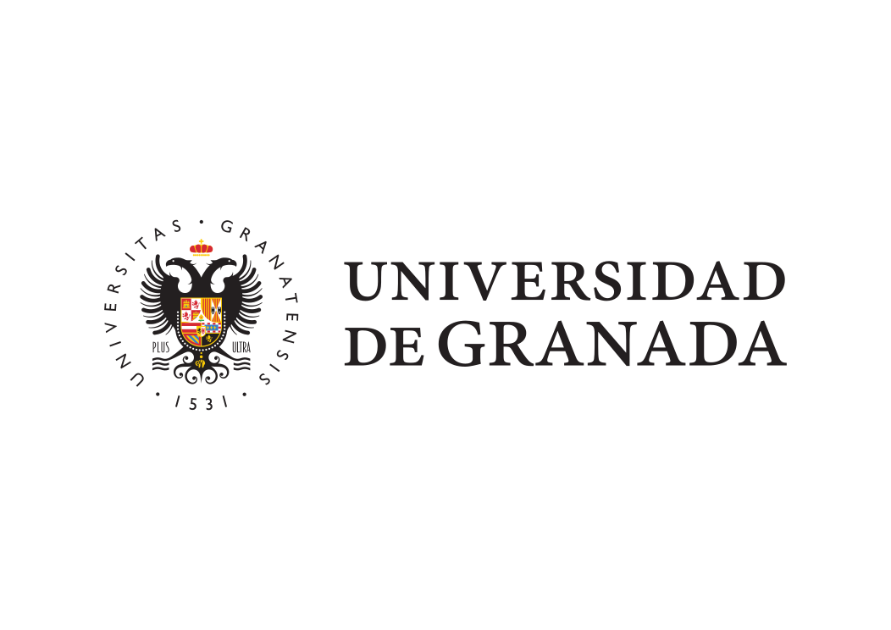
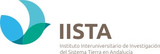
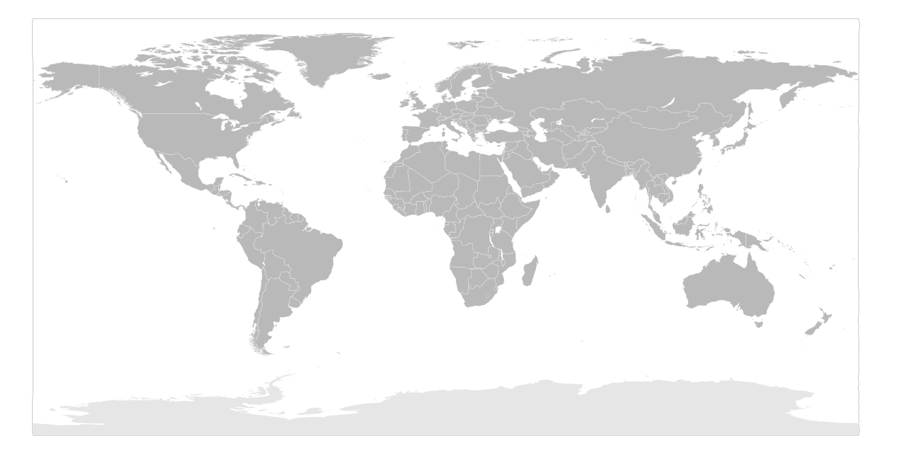

::: {.about-lead}
I am **José Manuel Camacho Sánchez, PhD**, an experimental aerodynamics researcher focused on bluff-body wakes, heavy-vehicle aerodynamics, and drag-reduction strategies.

My work connects controlled laboratory experiments with applied vehicle performance. I have worked with wind-tunnel testing, particle image velocimetry (PIV), pressure and force measurements, track testing, and the analysis of passive and active flow-control devices.
:::

## Academic Path {#academic-path}

::: {.path-timeline}

::: {.path-item}
::: {.path-date-block}
<span class="path-date">2026-present</span>
<span class="path-location">France</span>
:::

::: {.path-logo .path-logo-stacked}
```{=html}
<a class="path-logo-main" href="https://www.ensta.fr/" target="_blank" rel="noopener" aria-label="ENSTA Paris website">
  
</a>
<a class="path-logo-partner" href="https://www.thalesgroup.com/" target="_blank" rel="noopener" aria-label="Thales website">
  <span>Project with</span>
  
</a>
```
:::

::: {.path-content}
### Postdoctoral Researcher

<p class="path-role">ENSTA Paris | Experimental aerodynamics.</p>

I am currently a postdoctoral researcher at ENSTA Paris, continuing my work in experimental aerodynamics, wake dynamics, and flow-control strategies for bluff bodies and transport applications.
:::
:::

::: {.path-item .path-item-phd-main}
::: {.path-date-block}
<span class="path-date">2021-2026</span>
<span class="path-location">Jaén, Spain</span>
:::

::: {.path-logo}
[{fig-alt="Universidad de Jaén logo"}](https://www.ujaen.es/)
:::

::: {.path-content}
### PhD Thesis

<p class="path-role">Universidad de Jaén | Experimental aerodynamics of bluff bodies and heavy vehicles.</p>

Doctoral research focused on wake dynamics, wind-tunnel experiments, PIV, track testing, and passive or active drag-reduction strategies. This period also included external collaborations and research stays directly connected to the thesis.

::: {.linked-experiences}

::: {.linked-experience}
::: {.linked-logo .linked-logo-stacked}
```{=html}
<a href="https://www.ugr.es/" target="_blank" rel="noopener" aria-label="Universidad de Granada website">
  
</a>
<a href="https://iista.es/" target="_blank" rel="noopener" aria-label="IISTA website">
  
</a>
```
:::

::: {.linked-body}
<span class="linked-date">2023-2026</span>

##### Universidad de Granada / IISTA

Experimental campaigns and research activity at IISTA, associated with Universidad de Granada, linked to wind-tunnel measurements and aerodynamic analysis.
:::
:::

::: {.linked-experience}
::: {.linked-logo}
[{fig-alt="University of Liverpool logo"}](https://www.liverpool.ac.uk/)
:::

::: {.linked-body}
<span class="linked-date">2023</span>

##### University of Liverpool

Research stay on fluid-structure interaction and flexible drag-reduction devices.
:::
:::

:::
:::
:::

::: {.path-item}
::: {.path-date-block}
<span class="path-date">2019-2021</span>
<span class="path-location">Jaén, Spain</span>
:::

::: {.path-logo}
[{fig-alt="Universidad de Jaén logo"}](https://www.ujaen.es/)
:::

::: {.path-content}
### Master's Degree

<p class="path-role">Universidad de Jaén | Industrial Engineering and applied mechanics.</p>

Advanced training with increasing focus on experimental methods, fluid mechanics, and aerodynamic problems.
:::
:::

::: {.path-item}
::: {.path-date-block}
<span class="path-date">2015-2019</span>
<span class="path-location">Jaén, Spain</span>
:::

::: {.path-logo}
[{fig-alt="Universidad de Jaén logo"}](https://www.ujaen.es/)
:::

::: {.path-content}
### Bachelor's Degree

<p class="path-role">Universidad de Jaén | Mechanical Engineering.</p>

Technical foundation in engineering, later developed toward fluid mechanics, experimental methods, and vehicle aerodynamics.
:::
:::

:::

## Research Footprint {#research-footprint}

::: {.footprint-section}
::: {.footprint-intro}
My work has developed across a compact but international experimental network, connecting doctoral research in Andalusia with a research stay in the United Kingdom and postdoctoral work at ENSTA Paris.
:::

::: {.footprint-metrics}
::: {.metric-card}
<span class="metric-value">3</span>
<span class="metric-label">Countries</span>
:::

::: {.metric-card}
<span class="metric-value">5</span>
<span class="metric-label">Institutions and campaign sites</span>
:::

::: {.metric-card}
<span class="metric-value">1</span>
<span class="metric-label">Vehicle-scale on-track campaign</span>
:::
:::

```{=html}
<div class="footprint-map-card" data-footprint-map>
  <div class="footprint-map-toolbar" role="group" aria-label="Research footprint map controls">
    <button class="footprint-zoom-button" type="button" data-map-zoom="out" aria-label="Zoom out">−</button>
    <button class="footprint-zoom-button footprint-zoom-reset" type="button" data-map-zoom="reset" aria-label="Reset map zoom">Reset</button>
    <button class="footprint-zoom-button" type="button" data-map-zoom="in" aria-label="Zoom in">+</button>
  </div>
  <div class="footprint-map-viewport" tabindex="0" aria-label="Zoomable research footprint map showing Spain, the United Kingdom, and France">
    <div class="footprint-map" style="--map-scale: 1; --map-pan-x: 0px; --map-pan-y: 0px;">
      
      <a class="footprint-marker footprint-marker-uja" style="--x: 48.95%; --y: 29.00%;" href="https://www.ujaen.es/" target="_blank" rel="noopener" aria-label="Jaén, Spain: Universidad de Jaén">
        <span class="footprint-dot"></span>
        <span class="footprint-label">Jaén, Spain</span>
      </a>
      <div class="footprint-marker footprint-marker-granada" style="--x: 49.00%; --y: 29.35%;" aria-label="Granada, Spain: Universidad de Granada and IISTA">
        <span class="footprint-dot"></span>
        <span class="footprint-label footprint-label-links">
          <span>Granada, Spain</span>
          <span class="footprint-label-sub"><a href="https://www.ugr.es/" target="_blank" rel="noopener">UGR</a> / <a href="https://iista.es/" target="_blank" rel="noopener">IISTA</a></span>
        </span>
      </div>
      <a class="footprint-marker footprint-marker-liverpool" style="--x: 49.17%; --y: 20.33%;" href="https://www.liverpool.ac.uk/" target="_blank" rel="noopener" aria-label="Liverpool, United Kingdom: research stay">
        <span class="footprint-dot"></span>
        <span class="footprint-label">Liverpool, UK</span>
      </a>
      <a class="footprint-marker footprint-marker-france" style="--x: 50.61%; --y: 22.94%;" href="https://www.ensta.fr/" target="_blank" rel="noopener" aria-label="Paris-Saclay, France: ENSTA Paris postdoctoral research">
        <span class="footprint-dot"></span>
        <span class="footprint-label">ENSTA Paris</span>
      </a>
    </div>
  </div>
</div>
```

::: {.footprint-list}
::: {.footprint-item}
<span class="footprint-item-year">2015-2026</span>

### Universidad de Jaén

Academic formation, PhD research, wind-tunnel testing, PIV, aerodynamic analysis, and heavy-vehicle drag-reduction work.
:::

::: {.footprint-item}
<span class="footprint-item-year">2023-2026</span>

### Universidad de Granada / IISTA

Experimental campaigns and research activity at IISTA, associated with Universidad de Granada, connected to doctoral work, wind-tunnel measurements, and aerodynamic analysis.
:::

::: {.footprint-item}
<span class="footprint-item-year">2023</span>

### University of Liverpool

Research stay linked to the PhD, focused on fluid-structure interaction and flexible drag-reduction devices.
:::

::: {.footprint-item}
<span class="footprint-item-year">2026-present</span>

### ENSTA Paris

Postdoctoral research in experimental aerodynamics, wake dynamics, and flow-control strategies for bluff bodies and transport applications.
:::
:::

<p class="footprint-source">Map base: [BlankMap-World-Equirectangular.svg](https://commons.wikimedia.org/wiki/File:BlankMap-World-Equirectangular.svg), Wikimedia Commons, CC0/public domain. Marker positions use approximate city/campus coordinates.</p>
:::

```{=html}
<script>
(() => {
  document.querySelectorAll("[data-footprint-map]").forEach((card) => {
    const viewport = card.querySelector(".footprint-map-viewport");
    const map = card.querySelector(".footprint-map");
    const buttons = card.querySelectorAll("[data-map-zoom]");
    if (!viewport || !map || !buttons.length) return;

    const state = {
      scale: 1,
      x: 0,
      y: 0,
      dragging: false,
      startX: 0,
      startY: 0,
      originX: 0,
      originY: 0
    };

    const clamp = (value, min, max) => Math.min(Math.max(value, min), max);

    const clampPan = () => {
      if (state.scale <= 1) {
        state.x = 0;
        state.y = 0;
        return;
      }

      const maxX = (viewport.clientWidth * (state.scale - 1)) / 2;
      const maxY = (viewport.clientHeight * (state.scale - 1)) / 2;
      state.x = clamp(state.x, -maxX, maxX);
      state.y = clamp(state.y, -maxY, maxY);
    };

    const applyState = () => {
      clampPan();
      map.style.setProperty("--map-scale", state.scale.toFixed(2));
      map.style.setProperty("--map-pan-x", `${state.x.toFixed(0)}px`);
      map.style.setProperty("--map-pan-y", `${state.y.toFixed(0)}px`);
      viewport.dataset.zoomed = state.scale > 1 ? "true" : "false";
    };

    const setZoom = (nextScale) => {
      state.scale = clamp(nextScale, 1, 3);
      applyState();
    };

    buttons.forEach((button) => {
      button.addEventListener("click", () => {
        const action = button.dataset.mapZoom;
        if (action === "in") setZoom(state.scale + 0.4);
        if (action === "out") setZoom(state.scale - 0.4);
        if (action === "reset") {
          state.scale = 1;
          state.x = 0;
          state.y = 0;
          applyState();
        }
      });
    });

    viewport.addEventListener("pointerdown", (event) => {
      if (state.scale <= 1 || event.target.closest("a, button")) return;
      state.dragging = true;
      state.startX = event.clientX;
      state.startY = event.clientY;
      state.originX = state.x;
      state.originY = state.y;
      viewport.setPointerCapture(event.pointerId);
    });

    viewport.addEventListener("pointermove", (event) => {
      if (!state.dragging) return;
      state.x = state.originX + event.clientX - state.startX;
      state.y = state.originY + event.clientY - state.startY;
      applyState();
    });

    ["pointerup", "pointercancel", "pointerleave"].forEach((eventName) => {
      viewport.addEventListener(eventName, () => {
        state.dragging = false;
      });
    });

    viewport.addEventListener("keydown", (event) => {
      const step = 34;
      if (event.key === "+" || event.key === "=") {
        event.preventDefault();
        setZoom(state.scale + 0.4);
      } else if (event.key === "-") {
        event.preventDefault();
        setZoom(state.scale - 0.4);
      } else if (event.key === "0") {
        event.preventDefault();
        state.scale = 1;
        state.x = 0;
        state.y = 0;
        applyState();
      } else if (state.scale > 1 && ["ArrowLeft", "ArrowRight", "ArrowUp", "ArrowDown"].includes(event.key)) {
        event.preventDefault();
        if (event.key === "ArrowLeft") state.x += step;
        if (event.key === "ArrowRight") state.x -= step;
        if (event.key === "ArrowUp") state.y += step;
        if (event.key === "ArrowDown") state.y -= step;
        applyState();
      }
    });

    window.addEventListener("resize", applyState);
    applyState();
  });
})();
</script>
```

## Professional Service {#professional-service}

::: {.credential-grid}
::: {.credential-card}
<span class="credential-label">Committee Membership</span>

### SAE technical committee

Membership and technical-service details can be listed here once the exact committee name, role, and dates are confirmed.
:::

::: {.credential-card}
<span class="credential-label">Scientific Service</span>

### Reviewing and technical activities

Peer review, technical committees, workshop organisation, or society memberships can be added here as your professional-service record grows.
:::
:::

## Training and Certifications {#training-and-certifications}

::: {.credential-grid}
::: {.credential-card}
<span class="credential-label">Training</span>

### Technical courses

Courses related to experimental methods, vehicle aerodynamics, data analysis, safety, instrumentation, or research software can be grouped here, together with the logo of the issuing institution.
:::

::: {.credential-card}
<span class="credential-label">Certifications</span>

### Professional credentials

Certifications, licenses, and formal credentials can be listed with issuer, date, institutional logo, and a short note on relevance.
:::
:::

## Awards and Recognition {#awards-and-recognition}

::: {.credential-grid}
::: {.credential-card}
<span class="credential-label">Awards</span>

### Academic and research awards

Prizes, competitive scholarships, thesis awards, best-paper/poster awards, and other recognitions can be listed here.
:::

::: {.credential-card}
<span class="credential-label">Recognition</span>

### Research visibility

Invited talks, highlighted papers, media mentions, or institutional recognitions can be added as they become relevant.
:::
:::

## Research Profile

My research is motivated by a central question: how can the wake of a bluff body be understood, controlled, and translated into practical aerodynamic benefits?

I am particularly interested in:

- wake dynamics and pressure-drag mechanisms;
- self-adaptive and flexible drag-reduction devices;
- active and passive flow-control strategies;
- wind-tunnel-to-road experimental methodology;
- connecting PIV, pressure, force, and track-test measurements.
