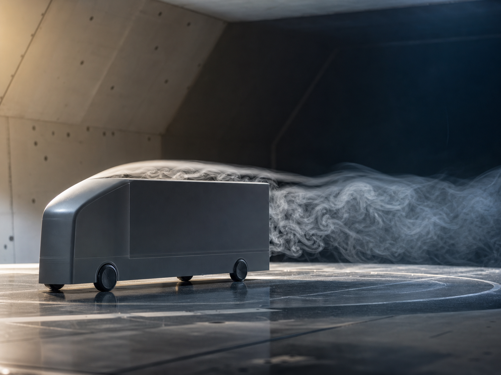
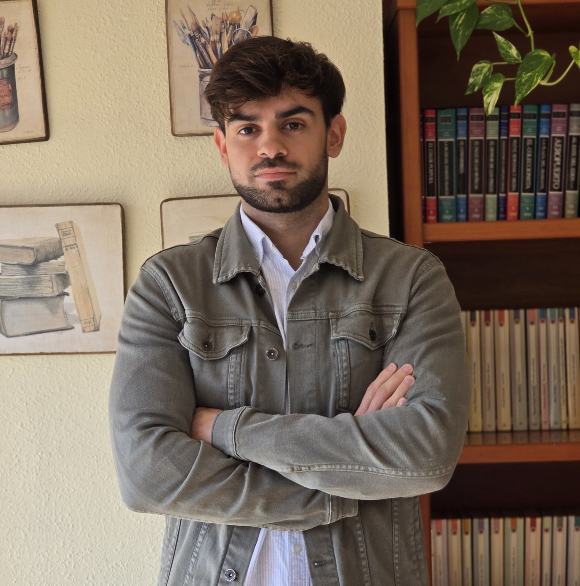

```{=html}
<section class="flow-panorama" aria-labelledby="flow-panorama-title">
  
  <canvas class="flow-panorama-canvas" data-flow-panorama aria-hidden="true"></canvas>
  <div class="flow-panorama-copy">
    <span class="flow-panorama-kicker">Experimental Aerodynamics</span>
    <h1 id="flow-panorama-title">José Manuel Camacho Sánchez</h1>
    <p>Bluff-body wakes, heavy vehicles, and flow-control strategies.</p>
  </div>
</section>

<script>
(() => {
  const canvas = document.querySelector("[data-flow-panorama]");
  if (!canvas) return;

  const context = canvas.getContext("2d");
  const reduceMotion = window.matchMedia("(prefers-reduced-motion: reduce)");
  let width = 0;
  let height = 0;
  let particles = [];
  let animationFrame = 0;
  let previousTime = 0;

  const random = (min, max) => min + Math.random() * (max - min);

  const resetParticle = (particle, initial = false) => {
    particle.x = initial ? random(-0.08, 1.05) : random(-0.12, -0.02);
    particle.baseY = random(0.2, 0.84);
    particle.speed = random(0.045, 0.105);
    particle.phase = random(0, Math.PI * 2);
    particle.size = random(0.7, 1.75);
    particle.alpha = random(0.24, 0.72);
    particle.tint = Math.random() > 0.72;
  };

  const rebuildParticles = () => {
    const count = width < 680 ? 42 : 82;
    particles = Array.from({ length: count }, () => {
      const particle = {};
      resetParticle(particle, true);
      return particle;
    });
  };

  const resize = () => {
    const bounds = canvas.getBoundingClientRect();
    const ratio = Math.min(window.devicePixelRatio || 1, 2);
    width = Math.max(1, bounds.width);
    height = Math.max(1, bounds.height);
    canvas.width = Math.round(width * ratio);
    canvas.height = Math.round(height * ratio);
    context.setTransform(ratio, 0, 0, ratio, 0, 0);
    rebuildParticles();
  };

  const draw = (time = 0) => {
    context.clearRect(0, 0, width, height);
    const seconds = time / 1000;
    const delta = previousTime ? Math.min((time - previousTime) / 1000, 0.05) : 0;
    previousTime = time;

    particles.forEach((particle) => {
      if (!reduceMotion.matches) particle.x += particle.speed * delta;
      if (particle.x > 1.08) resetParticle(particle);

      const wakeProgress = Math.max(0, Math.min(1, (particle.x - 0.35) / 0.65));
      const wakeEnvelope = Math.sin(wakeProgress * Math.PI);
      const oscillation = Math.sin(seconds * 1.35 + particle.x * 15 + particle.phase);
      const y = particle.baseY + oscillation * wakeEnvelope * 0.055;
      const xPixels = particle.x * width;
      const yPixels = y * height;
      const trail = (5 + particle.speed * 85) * (0.72 + wakeProgress * 0.55);

      context.beginPath();
      context.moveTo(xPixels - trail, yPixels);
      context.lineTo(xPixels, yPixels);
      context.strokeStyle = particle.tint
        ? `rgba(91, 199, 211, ${particle.alpha})`
        : `rgba(245, 249, 250, ${particle.alpha})`;
      context.lineWidth = particle.size;
      context.lineCap = "round";
      context.stroke();
    });

    if (!reduceMotion.matches && !document.hidden) {
      animationFrame = window.requestAnimationFrame(draw);
    }
  };

  const start = () => {
    window.cancelAnimationFrame(animationFrame);
    previousTime = 0;
    draw();
    if (!reduceMotion.matches && !document.hidden) {
      animationFrame = window.requestAnimationFrame(draw);
    }
  };

  new ResizeObserver(() => {
    resize();
    start();
  }).observe(canvas);

  reduceMotion.addEventListener("change", start);
  document.addEventListener("visibilitychange", start);
})();
</script>
```

::: {.profile-hero}

::: {.profile-visual}

:::

::: {.profile-intro}
<span class="profile-kicker">Experimental Aerodynamics</span>

<h2 class="profile-name-heading">José Manuel Camacho Sánchez <span class="degree-badge">PhD</span></h2>

<p class="profile-subtitle">Bluff-body wakes, heavy-vehicle aerodynamics, and drag-reduction strategies.</p>

<p class="profile-summary">I am an experimental aerodynamics researcher studying bluff-body wakes and drag-reduction strategies for heavy vehicles through wind-tunnel testing, particle image velocimetry (PIV), track experiments, and aerodynamic analysis.</p>

::: {.profile-socials}
[ ORCID](https://orcid.org/0000-0002-9453-2045)
[ GitHub](https://github.com/jmcamachosanchez)
[ LinkedIn](https://www.linkedin.com/in/jos%C3%A9-manuel-camacho-s%C3%A1nchez-711715196/)
[ ResearchGate](https://www.researchgate.net/profile/Jose-Camacho-Sanchez)
:::

:::

:::

## Latest Publications {#latest-publications}

::: {.publication-grid .publication-grid-home}

::: {.publication-card}
<span class="pub-year">2026</span>

### Self-adaptive elastic flaps with bending and torsion for 3D blunt body drag reduction

**J.M. Camacho-Sánchez**, M. Lorite-Díez, Y. Fan, J.I. Jiménez-González, and O. Cadot<br>
*Journal of Fluids and Structures*, 144, 104560.

::: {.pub-actions}
[ DOI](https://doi.org/10.1016/j.jfluidstructs.2026.104560){.pub-action}
[ View PDF](https://www.sciencedirect.com/science/article/pii/S0889974626000605/pdfft?isDTMRedir=true&download=true){.pub-action .pub-action-pdf}
[ Publisher](https://www.sciencedirect.com/science/article/pii/S0889974626000605){.pub-action}
:::
:::

::: {.publication-card}
<span class="pub-year">2025</span>

### Experimental analysis of the role of base blowing geometry on three-dimensional blunt body wakes

**J.M. Camacho-Sánchez**, M. Lorite-Díez, J.I. Jiménez-González, and C. Martínez-Bazán<br>
*Physics of Fluids*, 37(8), 085137.

::: {.pub-actions}
[ DOI](https://doi.org/10.1063/5.0275586){.pub-action}
[ View PDF](https://pubs.aip.org/aip/pof/article-pdf/doi/10.1063/5.0275586/20633218/085137_1_5.0275586.pdf){.pub-action .pub-action-pdf}
:::
:::

::: {.publication-card}
<span class="pub-year">2023</span>

### Experimental study on the effect of adaptive flaps on the aerodynamics of an Ahmed body

**J.M. Camacho-Sánchez**, M. Lorite-Díez, J.I. Jiménez-González, O. Cadot, and C. Martínez-Bazán<br>
*Physical Review Fluids*, 8(4), 044605.

::: {.pub-actions}
[ DOI](https://doi.org/10.1103/PhysRevFluids.8.044605){.pub-action}
[ View PDF](https://journals.aps.org/prfluids/pdf/10.1103/PhysRevFluids.8.044605){.pub-action .pub-action-pdf}
:::
:::

:::

<p class="more-link">[More publications »](publications.qmd)</p>

## Recent Posts {#recent-posts-section}

::: {#recent-posts}
:::

<p class="more-link">[All posts »](posts.qmd)</p>
