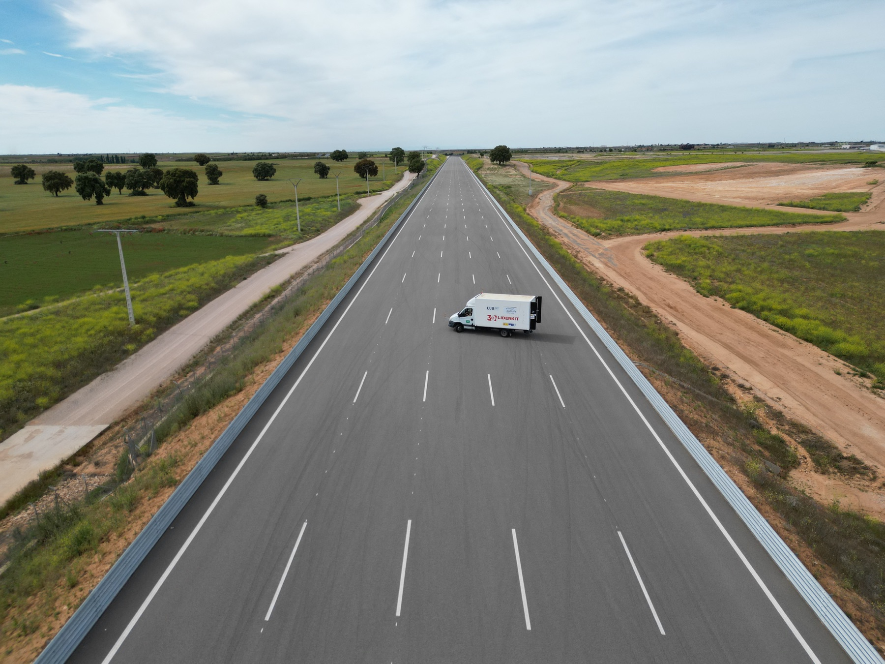
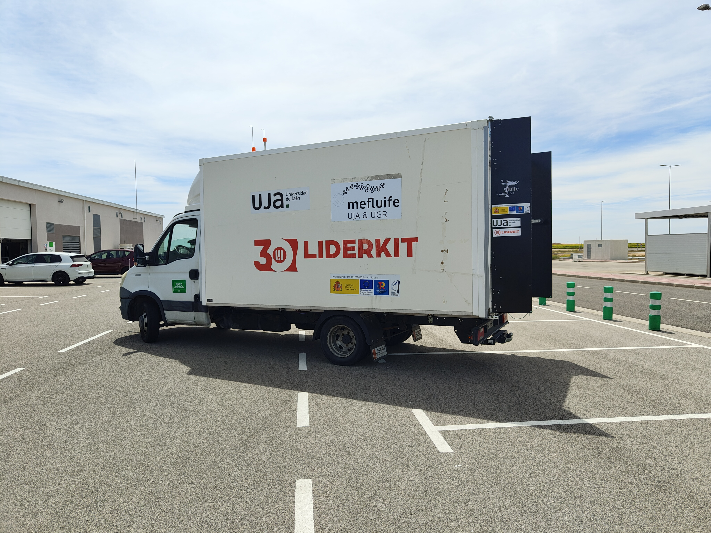
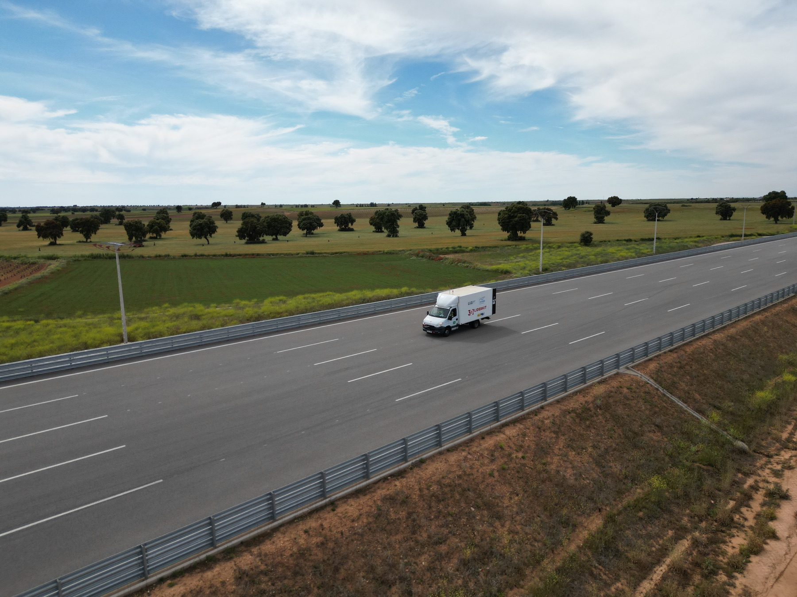
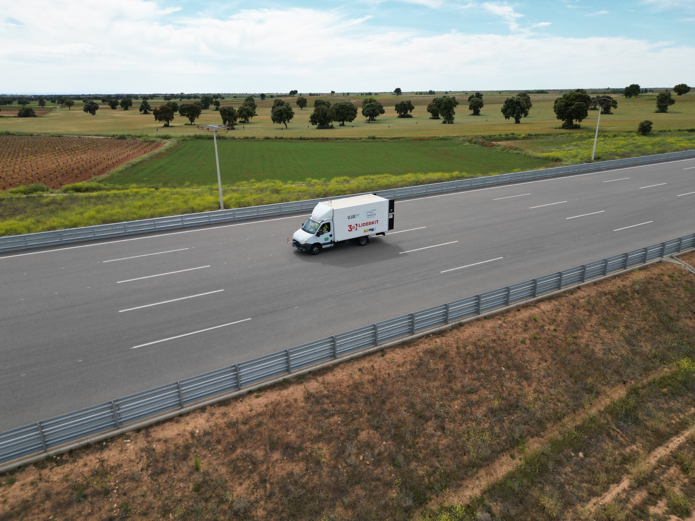
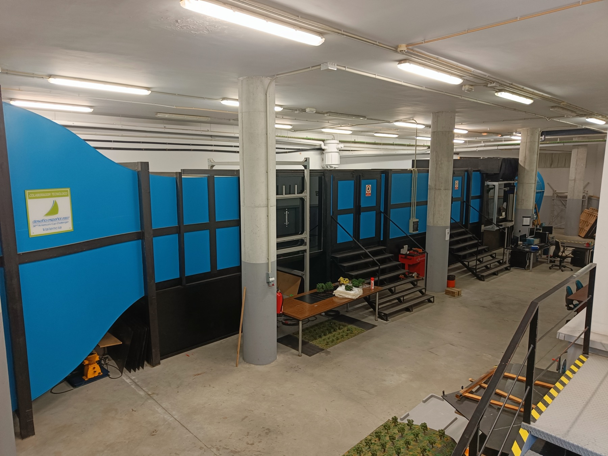
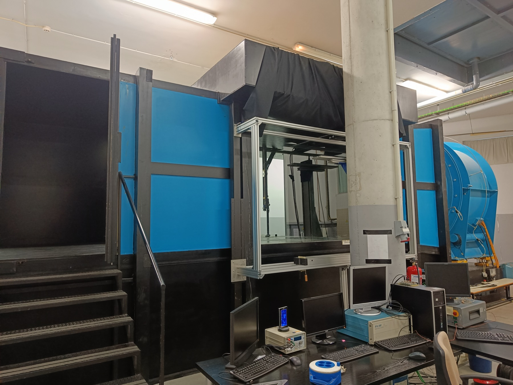
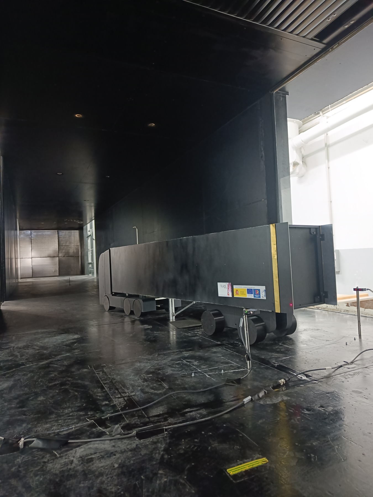
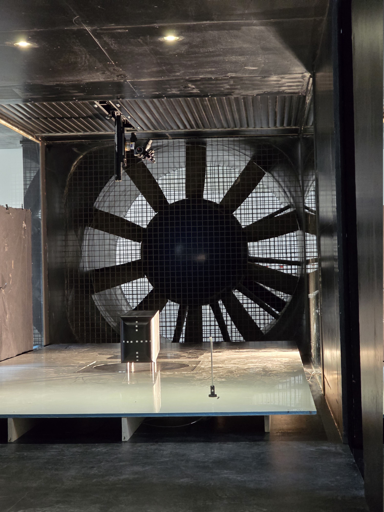
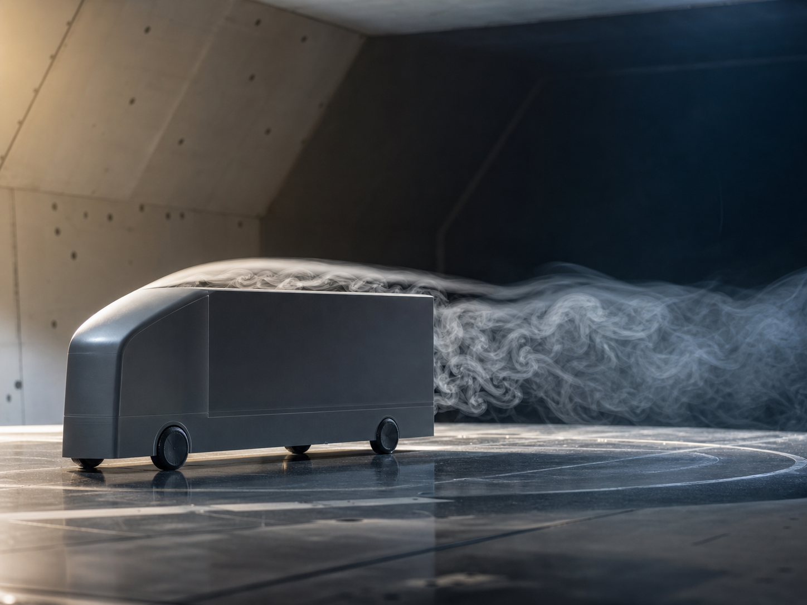

::: {.media-page}

::: {.media-lead}
Experimental aerodynamics is highly visual: models, facilities, measurement setups, flow fields, and conference discussions often explain the work faster than a paragraph can. This page is intended as a curated visual record of campaigns, methods, and scientific communication.
:::

::: {.media-feature}
::: {.media-feature-image}
{fig-alt="Aerial view of a heavy-vehicle test platform during an on-track aerodynamic testing campaign"}
:::

::: {.media-feature-copy}
On-Track Testing, 2024

## Full-Scale Aerodynamic Assessment

Experimental campaign with a heavy-vehicle test platform equipped with rear-mounted aerodynamic devices, aimed at connecting controlled wind-tunnel findings with vehicle-scale behaviour under more representative operating conditions.
:::
:::

## On-Track Testing Campaign, 2024

::: {.media-reel}
::: {.media-reel-header}
Experimental Campaign

### Vehicle-scale aerodynamic testing

Four-image reel documenting the 2024 on-track campaign with a heavy-vehicle test platform and rear-mounted drag-reduction devices.
:::

  <figure class="media-reel-slide">
    
    <figcaption>01 / 04 Test vehicle equipped with rear-mounted aerodynamic devices.</figcaption>
  </figure>
  <figure class="media-reel-slide">
    
    <figcaption>02 / 04 Controlled road section used for repeatable on-track measurements.</figcaption>
  </figure>
  <figure class="media-reel-slide">
    
    <figcaption>03 / 04 Full-scale testing under representative operating conditions.</figcaption>
  </figure>
  <figure class="media-reel-slide">
    
    <figcaption>04 / 04 Drone-based visual record of the experimental setup and road environment.</figcaption>
  </figure>

::: {.media-reel-dots aria-hidden="true"}

:::

:::

Click the left or right side of a photo, swipe, scroll horizontally, or use the arrow keys to move through the campaign reel. If idle, the reel advances automatically.

## IISTA Wind Tunnel, University of Granada

::: {.media-reel .media-reel-contain}
::: {.media-reel-header}
Wind-Tunnel Facility

### IISTA experimental aerodynamics infrastructure

Four-image reel documenting wind-tunnel testing facilities at IISTA, University of Granada, including model installation, test-section views, and the broader experimental environment.
:::

  <figure class="media-reel-slide">
    
    <figcaption>01 / 04 Wide view of the IISTA wind-tunnel hall and experimental infrastructure.</figcaption>
  </figure>
  <figure class="media-reel-slide">
    
    <figcaption>02 / 04 Facility view showing the wind-tunnel circuit, control area, and measurement setup.</figcaption>
  </figure>
  <figure class="media-reel-slide">
    
    <figcaption>03 / 04 Simplified heavy-vehicle model installed for aerodynamic measurements.</figcaption>
  </figure>
  <figure class="media-reel-slide">
    
    <figcaption>04 / 04 Test-section view with a bluff-body model, instrumentation, and the downstream fan.</figcaption>
  </figure>

::: {.media-reel-dots aria-hidden="true"}

:::

:::

Click the left or right side of a photo, swipe, scroll horizontally, or use the arrow keys to move through the wind-tunnel reel. If idle, the reel advances automatically.

## Other Experimental Material

::: {.media-gallery}

::: {.media-card}
{fig-alt="Flow visualisation around a simplified heavy-vehicle model"}

::: {.media-card-body}
Wind Tunnel

### Bluff-body wake experiments

Controlled tests on simplified heavy-vehicle and bluff-body geometries, focused on separation, wake topology, and aerodynamic drag.
:::
:::

::: {.media-card .media-card-placeholder}
::: {.media-placeholder-visual}
PIV
:::

::: {.media-card-body}
Measurement Setup

### Particle image velocimetry

Flow-field measurements designed to connect wake organisation with drag, pressure recovery, and unsteady aerodynamic loading.
:::
:::

::: {.media-card .media-card-placeholder}
::: {.media-placeholder-visual}
Devices
:::

::: {.media-card-body}
Flow Control

### Passive and active drag-reduction devices

Visual documentation of adaptive flaps, base-flow control concepts, and experimental configurations used to reduce pressure drag.
:::
:::

::: {.media-card .media-card-placeholder}
::: {.media-placeholder-visual}
Track
:::

::: {.media-card-body}
Road Testing

### Additional on-track material

Further images can be added as the experimental archive grows.
:::
:::

:::

## Conferences and Presentations

::: {.media-gallery .media-gallery-compact}

::: {.media-card .media-card-placeholder}
::: {.media-placeholder-visual}
Talk
:::

::: {.media-card-body}
Conference Presentation

### Research talks

Presentations of experimental results on bluff-body wakes, flow-control strategies, and heavy-vehicle aerodynamic performance.
:::
:::

::: {.media-card .media-card-placeholder}
::: {.media-placeholder-visual}
Poster
:::

::: {.media-card-body}
Scientific Exchange

### Posters and discussions

Visual material from conferences, workshops, and research visits where experimental methods and results are discussed with the community.
:::
:::

:::

:::
